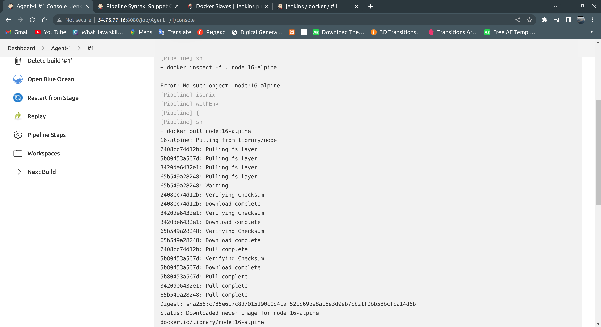

# Mandatory Task

## Task 1: Install Jenkins. It must be installed in a docker container.

### I created AWS EC2 Ubuntu instance 

### I installed Docker by [bash script](/mandatory/script/install.sh)

### The recommended Docker image to use is the Official jenkins/jenkins image (from the Docker Hub repository). This image contains the current Long-Term Support (LTS) release of Jenkins (which is production-ready). However this image doesn’t have docker CLI inside it and is not bundled with frequently used plugins and features. So that's why I ran "docker:dind" and customised official Jenkins Docker image

### I created a bridge network in Docker using the following docker network create command:
<pre>
docker network create jenkins
</pre>

### In order to execute Docker commands inside Jenkins nodes, I downloaded and ran the docker:dind Docker image using the following docker run command:
<pre>
docker run \
  --name jenkins-docker \
  --rm \
  --detach \
  --privileged \
  --network jenkins \
  --network-alias docker \
  --env DOCKER_TLS_CERTDIR=/certs \
  --volume jenkins-docker-certs:/certs/client \
  --volume jenkins-data:/var/jenkins_home \
  --publish 2376:2376 \
  docker:dind \
  --storage-driver overlay2
  </pre>

### To customise offical Jenkins Docker image I created Dockerfile with the following content:
<pre>
FROM jenkins/jenkins:2.346.1-jdk11
USER root
RUN apt-get update && apt-get install -y lsb-release
RUN curl -fsSLo /usr/share/keyrings/docker-archive-keyring.asc \
  https://download.docker.com/linux/debian/gpg
RUN echo "deb [arch=$(dpkg --print-architecture) \
  signed-by=/usr/share/keyrings/docker-archive-keyring.asc] \
  https://download.docker.com/linux/debian \
  $(lsb_release -cs) stable" > /etc/apt/sources.list.d/docker.list
RUN apt-get update && apt-get install -y docker-ce-cli
USER jenkins
RUN jenkins-plugin-cli --plugins "blueocean:1.25.5 docker-workflow:1.28"
</pre>

### I built a new docker image from this Dockerfile and assign the image a name
<pre>
docker build -t myjenkins-blueocean:2.346.1-1 .
</pre>

### I ran my own myjenkins-blueocean:2.346.1-1 image as a container in Docker using the following docker run command: 
<pre>
docker run \
  --name jenkins-blueocean \
  --restart=on-failure \
  --detach \
  --network jenkins \
  --env DOCKER_HOST=tcp://docker:2376 \
  --env DOCKER_CERT_PATH=/certs/client \
  --env DOCKER_TLS_VERIFY=1 \
  --publish 8080:8080 \
  --publish 50000:50000 \
  --volume jenkins-data:/var/jenkins_home \
  --volume jenkins-docker-certs:/certs/client:ro \
  myjenkins-blueocean:2.346.1-1 
</pre>

### I modified security group for EC2 instance and allowed inboud traffic for port: 8080

### In order to access secret key I ran following commands:
<pre>
docker container exec -it jenkins-blueocean bash
cat /var/jenkins_home/secrets/initialAdminPassword
</pre>

## Task 2: Install necessary plugins (if you need).

### I installed suggested plugins

 
## Task 3: Configure several (2-3) build agents. Agents must be run in docker

### I installed 2 plugins Docker Pipline to Build and use Docker containers from pipelines. And Docker Slave to use Docker containers to run Jenkins build agents.

### I created new Item Agent-1 which run docker image node:16-alpine => [pipline script](./mandatory/build_agents/Jenkinsfile-1)

<pre>
pipeline {
  agent {
    docker { image 'node:16-alpine' }
  }
  stages {
    stage('Test') {
      steps {
        sh 'node --version'
      }
    }
  }
}
</pre>

### I created New Item for Agent-2 which run dcoker image maven for backend and node for Front-end => [pipline script](./mandatory/build_agents/Jenkinsfile-2)

<pre>
 pipeline {
    agent none
    stages {
        stage('Back-end') {
        agent {
            docker { image 'maven:3.8.1-adoptopenjdk-11' }
        }
        steps {
            sh 'mvn --version'
        }
        }
        stage('Front-end') {
        agent {
            docker { image 'node:16-alpine' }
        }
        steps {
            sh 'node --version'
        }
        }
    }
}
</pre>

### I also configure Agent-3 wich will use Docker file => [pipline script](./mandatory/build_agents/Jenkinsfile-3)

<pre>
pipeline {
  agent { dockerfile true }
  stages {
    stage('Test') {
      steps {
        sh '''
          node --version
          git --version
          curl --version
        '''
      }
    }
  }
}
</pre>

## Task 4: Create a Freestyle project. Which will show the current date as a result of execution.

### I created Freestyle project "current_date" which will show the current date. I've used bash command "date" which will show current date

## Task 5: Create Pipeline which will execute docker ps -a in docker agent, running on Jenkins master’s Host

### I created pipline script which will execute docker ps -a in docker agent, running on Jenkins master’s Host => [pipline script](./mandatory/build_agents/Jenkinsfile-4)

<pre>
pipeline {
  agent {
    docker { 
        image 'ubuntu' 
        args '-u root:sudo'
    }
  }
  stages {
    stage('Install Docker') {
      steps {
        sh '''
           apt update -y
           apt install curl -y
           export DEBIAN_FRONTEND=noninteractive
           sudo apt update 2>/dev/null | grep packages | cut -d '.' -f 1
           curl https://get.docker.com/ > dockerinstall && chmod 777 dockerinstall && ./dockerinstall
           docker ps -a
        '''
      }
    }
  }
}
</pre>

## Task 6: Create Pipeline, which will build artifact using Dockerfile directly from your github repo (use Dockerfile from previous task).

## I created pipline script which will build artifact using Dockerfile directly from your github repo (use Dockerfile from previous task).

<pre>
pipeline {
  agent { dockerfile true }
  stages {
    stage('Test') {
      steps {
        sh '''
          apache2 -v
        '''
      }
    }
  }
} 
</pre>

[console_output]()

## Task 7: Pass  variable PASSWORD=QWERTY! To the docker container. Variable must be encrypted!!!

